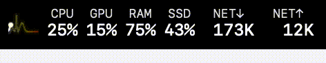

<div align="center">

# TrayPulsy

**Tray + Pulse — System heartbeat, always sensing.**

[]() []() []()

[中文](README.md) · [English](README_EN.md)

</div>

**TrayPulsy** is a lightweight macOS menu bar app that displays an animated character whose speed responds in real time to system usage. The busier your Mac, the faster it runs! Inspired by [RunCat365](https://github.com/Kyome22/RunCat365).

<p align="center">
  
</p>

## 📦 Install

```bash
brew tap krissss/tap
brew install --cask tray-pulsy
```

> **"App is damaged" on first launch?** This is macOS Gatekeeper blocking unsigned apps. Run:
> ```bash
> xattr -cr /Applications/TrayPulsy.app
> ```

## ✨ Features

| Feature | Description |
|---------|-------------|
| 🐱 **Multiple Skins** | Cat, Parrot, Horse, Mona, Dab and more, with custom skin support |
| ⚡ **Speed Source** | Animation speed follows real-time system metrics |
| 🎯 **Frame Rate Limit** | Multiple fps options to save battery |
| 🌓 **Theme Adaptation** | Multiple theme modes with auto icon color switching |
| 📊 **Real-time Metrics** | Overview panel for live system status |
| 🔢 **Status Bar Values** | Display multiple system metrics beside the icon |
| 🚀 **Launch at Login** | Auto-start on login via SMAppService |
| 🔒 **Single Instance** | File lock prevents duplicate launches |
| 😴 **Sleep Pause** | Auto-pause animation when display sleeps |
| ♿ **Accessibility** | Full VoiceOver support |
| 💾 **Persistent Settings** | All preferences saved via UserDefaults |

## 🎨 Skins

> Want to add a new skin? Just drop PNG frames into a folder under `Sources/Resources/skins/` — zero code changes needed.

## 🙏 Acknowledgements

- **[Kyome22/RunCat365](https://github.com/Kyome22/RunCat365)** — Inspiration & Cat, Parrot, Horse assets
- **[chux0519/runcat-tray](https://github.com/chux0519/runcat-tray)** — Mona, Dab, PartyBlobCat assets
- **[shenbo/runcat-pyqt5-win](https://github.com/shenbo/runcat-pyqt5-win)** — Mario, Points, RunCat_U assets
