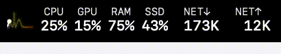

<div align="center">

# TrayPulsy

**Tray + Pulse — System heartbeat, always sensing.**

[]() []() []()

[中文](README.md) · [English](README_EN.md)

</div>

**TrayPulsy** is a lightweight macOS menu bar app that displays an animated character whose speed responds in real time to system usage. The busier your Mac, the faster it runs! Inspired by [RunCat365](https://github.com/Kyome22/RunCat365).

<p align="center">
  
</p>

## 📦 Install

```bash
brew tap krissss/tap
brew install --cask tray-pulsy
```

> **"App is damaged" on first launch?** This is macOS Gatekeeper blocking unsigned apps. Run:
> ```bash
> xattr -cr /Applications/TrayPulsy.app
> ```

## ✨ Features

| Feature | Description |
|---------|-------------|
| 🐱 **Multiple Skins** | Built-in Pulsy waveform skin, online skin catalog, and custom PNG skins |
| ⚡ **Dynamic Speed** | Animation speed can follow CPU, GPU, memory, or disk activity |
| 🔢 **Status Bar Metrics** | Choose which CPU, GPU, memory, disk, and network metrics appear beside the menu bar icon, with threshold colors |
| 📊 **Live Monitoring** | Menu bar popover and Overview panel show live status and history charts |
| 🧭 **Process Rankings** | Popover and Overview show top CPU, memory, and network processes with network sort modes |
| 🩺 **Spike Diagnostics** | Automatically records sudden CPU, memory, or network jumps and samples top processes on demand |
| 🎛️ **Customization** | Configure skins, themes, speed source, frame rate limit, status metrics, and launch at login |
| 🔄 **Auto Update** | Sparkle 2 integration for checking, downloading, installing, and restarting into updates |
| ♿ **Accessibility** | VoiceOver support with accessible status labels |

## 🎨 Skins

- **Built-in skin**: the app keeps the programmatic Pulsy waveform skin by default and no longer bundles PNG skin frames inside the app package.
- **Pulsy configuration**: Pulsy supports color themes, waveform styles, line width, glow intensity, and amplitude sensitivity.
- **Online skin catalog**: PNG skins are hosted in [tray-pulsy-skins](https://github.com/krissss/tray-pulsy-skins); Settings can preview animations, install skins locally, and use the remote manifest order for display.
- **External skins**: choose an external skin directory in Settings; each subfolder is one PNG frame sequence, the folder name becomes the skin name, and matching names override installed online skins.

## 📊 System Monitoring

- **Menu bar popover**: left-click the menu bar icon to open live metrics with current values and history charts.
- **Overview panel**: the main window shows system trend charts plus CPU, memory, and network process rankings.
- **Process details**: CPU process usage is normalized to whole-machine scale, memory rows show both size and percentage, and network rows can sort by activity, download, upload, or total throughput.
- **Spike diagnostics**: when CPU, memory, or network metrics jump suddenly, the Overview panel records the spike time, delta, and top processes at that moment.
- **On-demand sampling**: process monitoring only runs while the popover is expanded or the Overview panel is visible, then stops and clears data when closed.

## 🔄 Auto Update

TrayPulsy uses Sparkle 2 for automatic updates. You can check for updates from the About page; new versions are published through GitHub Releases and appcast, with support for downloading, installing, and restarting into the latest build.

## 🙏 Acknowledgements

- **[Kyome22/RunCat365](https://github.com/Kyome22/RunCat365)** — Inspiration and source for online RunCat, Parrot, Horse, and related assets
- **[chux0519/runcat-tray](https://github.com/chux0519/runcat-tray)** — Source for online Mona, Dab, PartyBlobCat, and related assets
- **[shenbo/runcat-pyqt5-win](https://github.com/shenbo/runcat-pyqt5-win)** — Source for online Mario, Points, RunCat_U, and related assets
